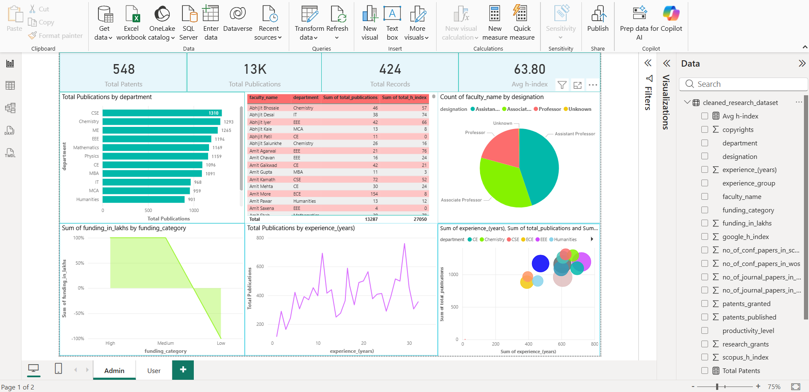
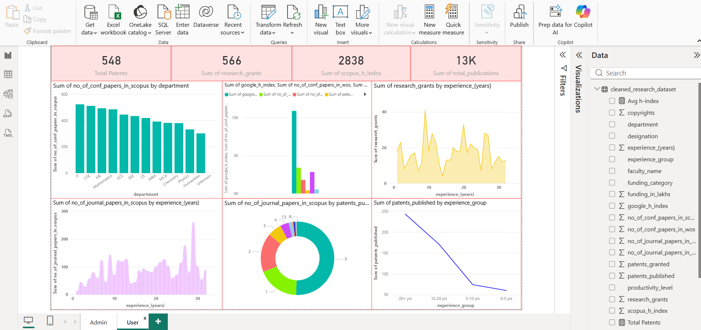

# Faculty-Research-Analytics-Dashboards

In the modern academic environment, analyzing research performance effectively is essential 
for improving productivity and decision-making. This mini project focuses on transforming a 
preprocessed research dataset into meaningful insights using interactive dashboards. The 
dataset includes various research-related attributes such as research grants, number of journal 
publications, conference papers, patents, Scopus index, Google citations, and faculty 
experience. 

The primary objective of this project is to design and develop two distinct dashboards using 
Power BI—an Admin Dashboard for detailed monitoring and a User Dashboard for 
simplified, insight-driven visualization. The Admin Dashboard provides comprehensive 
analysis through multiple key performance indicators (KPIs), charts, and filters, enabling 
detailed exploration of research data. In contrast, the User Dashboard focuses on presenting 
key insights in a visually appealing and easy-to-understand format using advanced 
visualizations such as treemaps, scatter plots, area charts, and filled maps. 
Various data visualization techniques and DAX measures were used to analyze relationships 
between research funding, publication output, and research impact. Interactive elements such 
as slicers and tooltips were incorporated to enhance user experience and enable dynamic data 
exploration. 

The results of this project demonstrate how data visualization tools can convert complex 
datasets into intuitive dashboards, helping stakeholders identify trends, compare performance, 
and make informed decisions. This project highlights the importance of business intelligence 
tools in academic analytics and showcases the effectiveness of dashboard-driven data 
analysis. 
